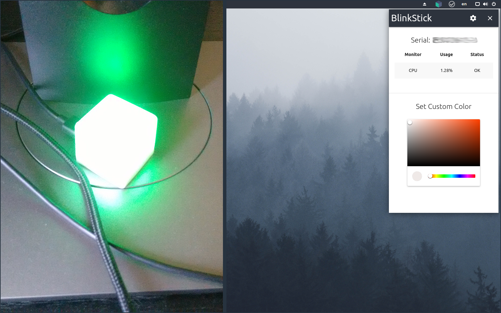

# BlinkStick: Control Center

Turn your BlinkStick into a hardware monitor

## What?

Ever heard of [BlinkStick](https://www.blinkstick.com/)? To quote from their website:

> BlinkStick brings colorful notifications to your computer and wide range programming language implementations give you the power to control LEDs without the need to program a microcontroller.

This program turns your BlinkStick into a hardware monitor that will change it's color depending on your CPU or RAM usage. See below Tresholds:

- OK (green):       < 50%
- Warning (orange): >= 50%
- Critical (red):   >= 80%

## How?

It's developed as a simple Tray Application in Electron. If you want to check details or set a custom color for the BlinkStick you can do so by clicking the tray icon.

## Credits

Cube Icon by inkscape.org and royalty-free.
